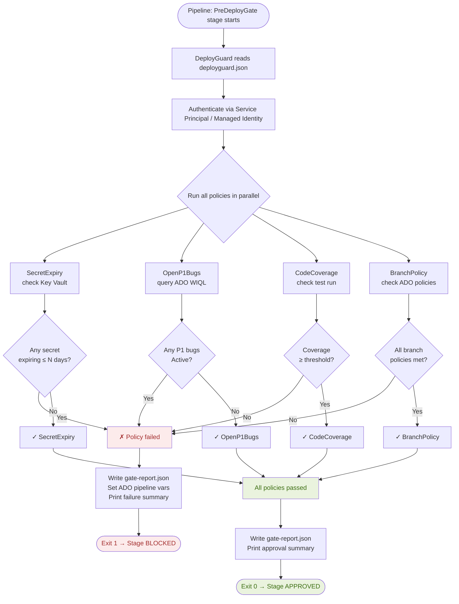

# DeployGuard

> A PowerShell + .NET pre-deployment policy checker that runs as an Azure DevOps pipeline task. Before any release, it validates secret expiry in Azure Key Vault, open P1 bugs in the work item backlog, code coverage threshold, and branch policy compliance — then blocks or approves the deployment.

[](https://github.com/PowerShell/PowerShell)
[](https://dotnet.microsoft.com/)
[](https://azure.microsoft.com/en-us/products/devops)
[](https://azure.microsoft.com/en-us/products/key-vault)
[](LICENSE)

---

## Overview

DeployGuard is a composable pre-deployment gate that plugs into any Azure DevOps YAML pipeline as a single task. It runs a configurable set of policy checks against live Azure and ADO data and exits with code `0` (approve) or `1` (block), causing the pipeline stage to pass or fail accordingly.

Each check is an independent **policy module** — you can enable, disable, or add new policies via config without touching the core engine. All checks run in parallel and produce a structured JSON report uploaded as a pipeline artefact.

### Built-in Policies

| Policy | What it checks | Blocks if |
|---|---|---|
| `SecretExpiry` | Azure Key Vault secret expiry dates | Any secret expires within N days |
| `OpenP1Bugs` | ADO work items with Priority=1, State=Active | Count > 0 in the target area path |
| `CodeCoverage` | ADO test run results for latest build | Line coverage < threshold % |
| `BranchPolicy` | ADO branch policies on target branch | Required reviewers, work item linking not met |

---

## Architecture

### Pipeline Integration

```
Azure DevOps YAML Pipeline
│
├── Stage: Build
│   └── Job: BuildAndTest
│       ├── dotnet build
│       ├── dotnet test (publishes coverage)
│       └── Publish artefacts
│
├── Stage: PreDeployGate  ◄── DeployGuard runs here
│   └── Job: PolicyCheck
│       └── Task: DeployGuard@1
│           ├── Inputs: environment, keyVaultName, areaPath, coverageThreshold
│           └── Output: gate-report.json (pipeline artefact)
│               ├── exit 0 → Stage: Deploy proceeds
│               └── exit 1 → Stage: Deploy BLOCKED, pipeline fails
│
└── Stage: Deploy (only runs if PreDeployGate succeeds)
    └── Job: DeployToProduction
```

### Internal Architecture

```
┌─────────────────────────────────────────────────────────────────────────┐
│                         DEPLOYGUARD ENGINE                              │
│                         (.NET 8 console app)                            │
│                                                                         │
│  ┌─────────────────────────────────────────────────────────────────┐   │
│  │  PolicyRunner                                                   │   │
│  │  • Loads enabled policies from deployguard.json                 │   │
│  │  • Runs all policies in parallel (Task.WhenAll)                 │   │
│  │  • Collects PolicyResult {Pass/Fail, PolicyName, Details}       │   │
│  │  • Aggregates: any Fail → overall BLOCK                         │   │
│  └───────────────────────────────┬─────────────────────────────────┘   │
│                                  │                                      │
│        ┌─────────────────────────┼──────────────────────────┐          │
│        │                         │                          │           │
│  ┌─────▼──────────┐  ┌───────────▼───────────┐  ┌──────────▼───────┐  │
│  │ SecretExpiry   │  │  OpenP1Bugs           │  │  CodeCoverage    │  │
│  │ Policy         │  │  Policy               │  │  Policy          │  │
│  │                │  │                       │  │                  │  │
│  │ Azure Key Vault│  │ ADO REST API          │  │ ADO REST API     │  │
│  │ SDK:           │  │ WIQL query:           │  │ Test runs API:   │  │
│  │ GetSecretAsync │  │ SELECT [Id] FROM      │  │ GET latest run   │  │
│  │ foreach secret │  │ WorkItems WHERE       │  │ coverage %       │  │
│  │ check Expiry   │  │ Priority=1 AND        │  │ compare vs       │  │
│  │ within N days  │  │ State=Active AND      │  │ threshold        │  │
│  └────────────────┘  │ AreaPath UNDER '...'  │  └──────────────────┘  │
│                      └───────────────────────┘                         │
│        ┌─────────────────────────┐                                      │
│        │  BranchPolicy Policy   │                                      │
│        │                        │                                      │
│        │  ADO REST API:         │                                      │
│        │  GET /policy/configs   │                                      │
│        │  Check: requiredReview │                                      │
│        │  Check: workItemLink   │                                      │
│        └────────────────────────┘                                      │
│                                                                         │
│  ┌─────────────────────────────────────────────────────────────────┐   │
│  │  ReportWriter                                                   │   │
│  │  • Writes gate-report.json → ##vso[task.uploadsummary] call     │   │
│  │  • Writes ADO pipeline variables: GATE_RESULT, FAILED_POLICIES  │   │
│  │  • Prints colour-coded summary to stdout (ADO log)              │   │
│  │  • Exits 0 (APPROVED) or 1 (BLOCKED)                           │   │
│  └─────────────────────────────────────────────────────────────────┘   │
└─────────────────────────────────────────────────────────────────────────┘
```

### Policy Check Flow



### Authentication Flow (Managed Identity preferred)

```
DeployGuard running in ADO pipeline agent
        │
        │  Uses: AZURE_CLIENT_ID / service connection
        │        (no passwords stored anywhere)
        │
        ├──► Azure Key Vault
        │    (role: Key Vault Secrets Reader)
        │
        └──► Azure DevOps REST API
             (SYSTEM_ACCESSTOKEN — built-in ADO token)
             (role: Project Reader on target project)
```

---

## Tech Stack

| Component | Technology |
|---|---|
| Core engine | .NET 8 console app |
| Azure integration | Azure.Security.KeyVault.Secrets SDK |
| ADO integration | Azure DevOps REST API (via HttpClient + PAT / SYSTEM_ACCESSTOKEN) |
| PowerShell wrapper | PowerShell 7.4 — installs + invokes the .NET tool |
| Auth | DefaultAzureCredential (Managed Identity preferred, SP fallback) |
| Config | JSON (deployguard.json) + ADO pipeline inputs |
| Output | JSON report + ADO logging commands (##vso[...]) |

---

## Project Structure

```
DeployGuard/
├── src/
│   ├── DeployGuard.Runner/              # .NET console app entry point
│   │   ├── Program.cs
│   │   └── deployguard.json             # Default policy config
│   ├── DeployGuard.Core/                # Policy engine
│   │   ├── Engine/
│   │   │   ├── PolicyRunner.cs          # Parallel Task.WhenAll
│   │   │   ├── PolicyResult.cs
│   │   │   └── GateReport.cs
│   │   ├── Policies/
│   │   │   ├── IPolicy.cs               # Policy interface
│   │   │   ├── SecretExpiryPolicy.cs
│   │   │   ├── OpenP1BugsPolicy.cs
│   │   │   ├── CodeCoveragePolicy.cs
│   │   │   └── BranchPolicyCheck.cs
│   │   └── Reporting/
│   │       ├── ReportWriter.cs
│   │       └── AdoPipelineLogger.cs     # ##vso logging commands
│   └── DeployGuard.Tests/
│       ├── SecretExpiryPolicyTests.cs
│       ├── OpenP1BugsPolicyTests.cs
│       └── PolicyRunnerTests.cs
├── task/
│   ├── task.json                        # ADO custom task manifest
│   └── DeployGuard.ps1                  # PowerShell wrapper script
└── README.md
```

---

## Usage

### In your Azure DevOps YAML pipeline

```yaml
stages:
  - stage: Build
    jobs:
      - job: BuildAndTest
        steps:
          - script: dotnet test --collect:"XPlat Code Coverage"

  - stage: PreDeployGate
    dependsOn: Build
    jobs:
      - job: PolicyCheck
        steps:
          - task: PowerShell@2
            displayName: 'Run DeployGuard'
            inputs:
              filePath: '$(System.DefaultWorkingDirectory)/task/DeployGuard.ps1'
              arguments: >
                -KeyVaultName "$(KEY_VAULT_NAME)"
                -AreaPath "MyProject\\Backend"
                -CoverageThreshold 80
                -SecretExpiryWarningDays 14
                -Environment "production"
            env:
              SYSTEM_ACCESSTOKEN: $(System.AccessToken)

  - stage: Deploy
    dependsOn: PreDeployGate
    condition: succeeded('PreDeployGate')
    jobs:
      - deployment: DeployToProduction
```

### deployguard.json — policy configuration

```json
{
  "policies": {
    "secretExpiry": {
      "enabled": true,
      "warningDays": 14,
      "keyVaultName": "my-keyvault"
    },
    "openP1Bugs": {
      "enabled": true,
      "areaPath": "MyProject\\Backend",
      "organization": "myorg",
      "project": "MyProject"
    },
    "codeCoverage": {
      "enabled": true,
      "thresholdPercent": 80
    },
    "branchPolicy": {
      "enabled": true,
      "targetBranch": "main",
      "requiredApprovers": 1,
      "requireWorkItemLink": true
    }
  }
}
```

### Sample gate-report.json output

```json
{
  "timestamp": "2025-06-01T14:32:00Z",
  "environment": "production",
  "overallResult": "BLOCKED",
  "policies": [
    {
      "name": "SecretExpiry",
      "result": "FAIL",
      "details": "Secret 'db-connection-string' expires in 3 days (2025-06-04)"
    },
    { "name": "OpenP1Bugs",   "result": "PASS", "details": "0 active P1 bugs found" },
    { "name": "CodeCoverage", "result": "PASS", "details": "Coverage: 84.2% (threshold: 80%)" },
    { "name": "BranchPolicy", "result": "PASS", "details": "All branch policies satisfied" }
  ]
}
```

---

## Adding a Custom Policy

Implement `IPolicy` and register it — no changes to the engine needed:

```csharp
public class MyCustomPolicy : IPolicy
{
    public string Name => "MyCustomPolicy";

    public async Task<PolicyResult> EvaluateAsync(
        PolicyContext context,
        CancellationToken ct)
    {
        // your check here
        return PolicyResult.Pass(Name, "All good");
        // or: return PolicyResult.Fail(Name, "Reason for blocking");
    }
}
```

---

## License

MIT — see [LICENSE](LICENSE) for details.
